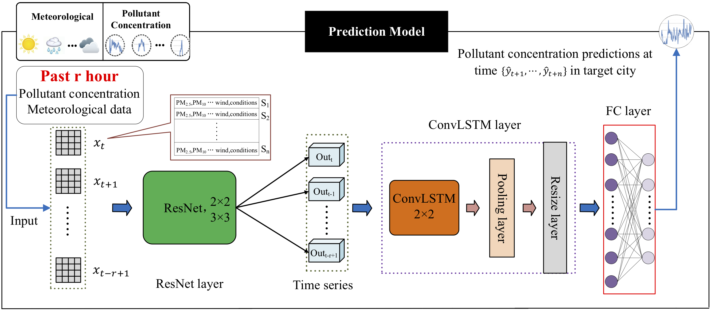
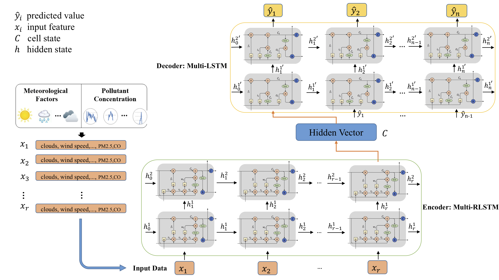

# 📚 Open-Source Air Pollution Prediction Models

Welcome to this collection of research papers on air pollution prediction, where the models are shared as open-source projects. This repository serves as a valuable resource for researchers, developers, and enthusiasts who want to explore and build on existing models.

---

## 🌟 Stay Connected  
If you have any questions or suggestions, feel free to reach out to us!  

- 📧 **Email:** [m.abbasi1@email.kntu.ac.ir](mailto:m.abbasi1@email.kntu.ac.ir)  

We appreciate your interest and support. Thank you! 🙌

---

## 🎯 Purpose  
This repository gathers papers that contribute to air pollution prediction, focusing on models shared openly for reproducibility and further development.

---

## 📝 Included Papers

# 🌟 RCL-Learning  
**RCL-Learning: ResNet and convolutional long short-term memory-based spatiotemporal air pollutant concentration prediction model**  

  

**Abstract**  
Predicting air pollutant concentrations is crucial for pollution prevention and early warnings. This project proposes **RCL-Learning**, a model combining **ResNet** for spatial feature extraction and **ConvLSTM** for spatiotemporal sequence learning. Key highlights:  
- **Accurate multi-city PM2.5 predictions** with RMSE ranging from **5.478 to 13.622** for 1- to 3-hour tasks.  
- **Robust multiscale forecasting** with an average RMSE of **22.927** for 1- to 15-hour tasks.  
- Improved prediction performance over traditional models and other neural network approaches.  

**Model Overview**

  

**Model Architecture**   
1. **ResNet**  
   - Extracts spatial distribution features of pollutant concentrations and meteorological data.  
2. **ConvLSTM**  
   - Captures spatiotemporal dependencies from the ResNet-extracted features for accurate forecasting.  

**Performance Evaluation**  
| **Prediction Horizon** | **RMSE (Min)** | **RMSE (Max)** |  
|-------------------------|----------------|----------------|  
| 1–3 hours              | 5.478          | 13.622         |  
| 1–15 hours             | -              | 22.927         |  

**Resources**   
- **Paper**: [Read Here](https://www.sciencedirect.com/science/article/abs/pii/S0957417422012349)  
- **Code Repository**: [GitHub](https://github.com/zouguojian/RCL-Learning)  
- **Code Capsule**: [CodeOcean](https://codeocean.com/capsule/6049117/tree)  

**Citation** 
If you use this work, please cite as:
* Latex inference:

      @article{zhang2022rcl,  
            title={RCL-Learning: ResNet and convolutional long short-term memory-based spatiotemporal air pollutant concentration prediction model},  
            author={Zhang, Bo and Zou, Guojian and Qin, Dongming and Ni, Qin and Mao, Hongwei and Li, Maozhen},  
            journal={Expert Systems with Applications},  
            pages={118017},  
            year={2022},  
            publisher={Elsevier}  
           }  

---

# 🌍 RLSTM-LSTM: Read-First LSTM for Air Pollutant Prediction  

**A Novel Encoder-Decoder Model Based on Read-First LSTM for Air Pollutant Prediction**  

  
  

**Abstract**    
Predicting air pollutant concentrations is crucial for effective environmental management and pollution prevention. In this study, we propose **RLSTM**, a Read-First LSTM that addresses the dependency between gate units, enabling better long-term feature extraction compared to traditional RNNs, LSTMs, and GRUs.  
We combine RLSTM as the Encoder and LSTM as the Decoder to build an **Encoder-Decoder System (EDSModel)** for air pollutant prediction. Key highlights of our findings:  
- Superior **long-term prediction accuracy** with RMSE of **30.218** for 1 to 24-hour tasks.  
- Overcomes traditional challenges in time-series modeling.  

**Model Overview**  

  

  

**Performance Evaluation** 
| **Prediction Horizon** | **Metric**      | **Value** |  
|-------------------------|-----------------|-----------|  
| 1–24 hours             | RMSE            | 30.218    |  

**Resources**    
- **Paper**: [Read Here](https://www.sciencedirect.com/science/article/abs/pii/S0048969720380384)  
- **Code Repository**: [GitHub](https://github.com/zouguojian/Read-first-LSTM)  

**Citation**  
If you use this work, please cite as:  

	@article{zhang2021novel,  
  	  title={A novel Encoder-Decoder model based on read-first LSTM for air pollutant prediction},  
  	  author={Zhang, Bo and Zou, Guojian and Qin, Dongming and Lu, Yunjie and Jin, Yupeng and Wang, Hui},  
  	  journal={Science of The Total Environment},  
  	  volume={765},  
  	  pages={144507},  
 	 year={2021},  
 	 publisher={Elsevier}  
	}

